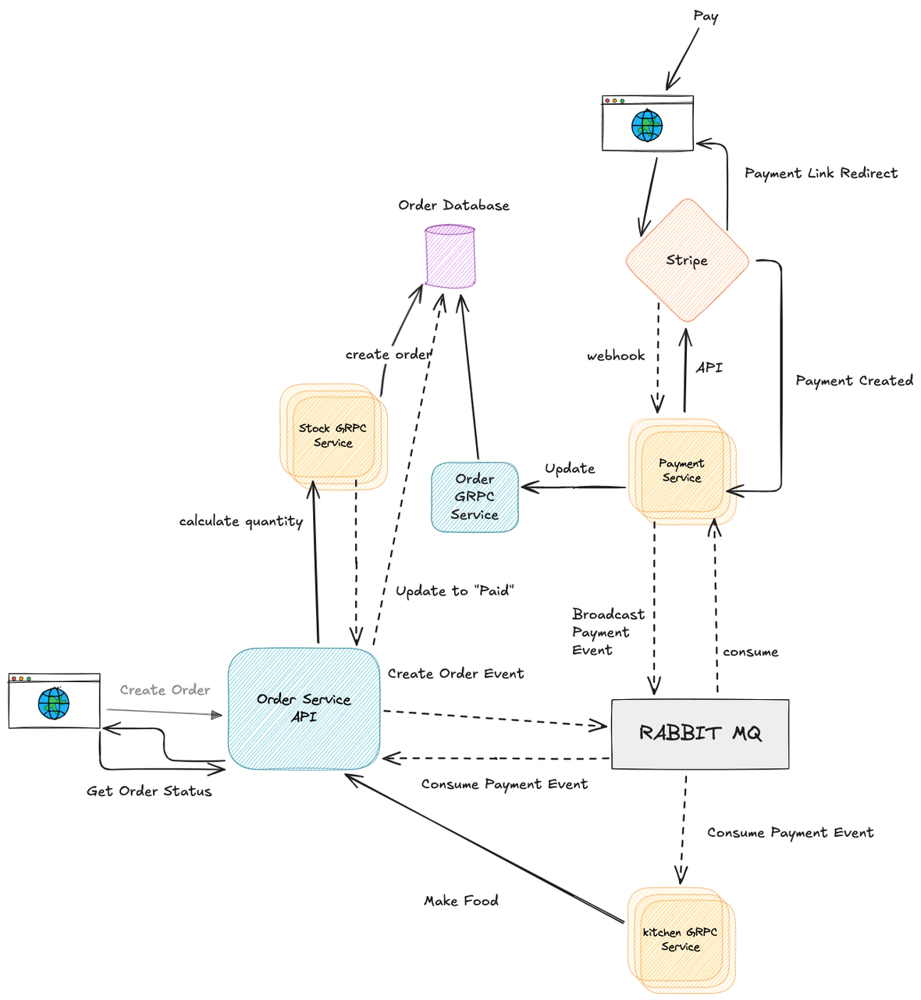

---
# 微服务支付系统

## 项目概述

本项目是基于微服务架构构建的在线支付系统，支持分布式服务注册与发现、异步支付处理、服务间通信与链路追踪等能力，具备良好的可扩展性与可维护性。

## 技术栈

- **后端框架**：`Gin、gRPC、OpenAPI`
- **配置管理**：`viper`
- **服务通信**：`protobuf、gRPC、RabbitMQ`
- **数据库**：`MySQL、MongoDB`
- **缓存与消息中间件**：`Redis、RabbitMQ`
- **服务注册与发现**：`Consul`
- **链路追踪**：`OpenTelemetry、Jaeger`
- **支付接入**：`Stripe API`
- **容器化部署**：`Docker`

## 项目特点

- ✅ **DDD 架构 + CQRS 模式**：实现读写分离，采用依赖倒置原则优化模块间的交互，提升系统可扩展性与维护性。
- ✅ **服务注册与链路追踪**：使用 Consul 实现服务注册与发现，借助 OpenTelemetry 与 Jaeger 实现分布式调用链路追踪，便于故障排查与性能瓶颈定位。
- ✅ **Stripe 在线支付接入**：集成 Stripe API 实现在线支付能力。
- ✅ **异步事件处理机制**：基于 RabbitMQ 实现 `payment` 事件的创建与消费，有效支持支付流程的异步处理。
- ✅ **高性能服务通信**：服务间通过 gRPC 通信，提升系统整体的调用效率与可靠性。

## 模块设计

```
├── api             // OpenAPI 定义及网关配置
├── auth            // 认证与授权服务
├── payment         // 支付核心模块
├── user            // 用户模块
├── event-consumer  // RabbitMQ 消费者服务
├── common          // 通用组件：日志、中间件、工具包等
└── deploy          // Docker 容器部署配置
```

# 技术栈及框架概览
## 后端
```c
· Go 1.22.4
· Stripe API
· Docker
· Consul
· RabbitMQ
· MongoDB
· MySQL
· Protobuf
· OpenAPI 3.0
· Gin
· Viper
· OpenTelemetry
· Bash
```
## 项目架构
```c
· 微服务
· DDD
· CQRS
```

